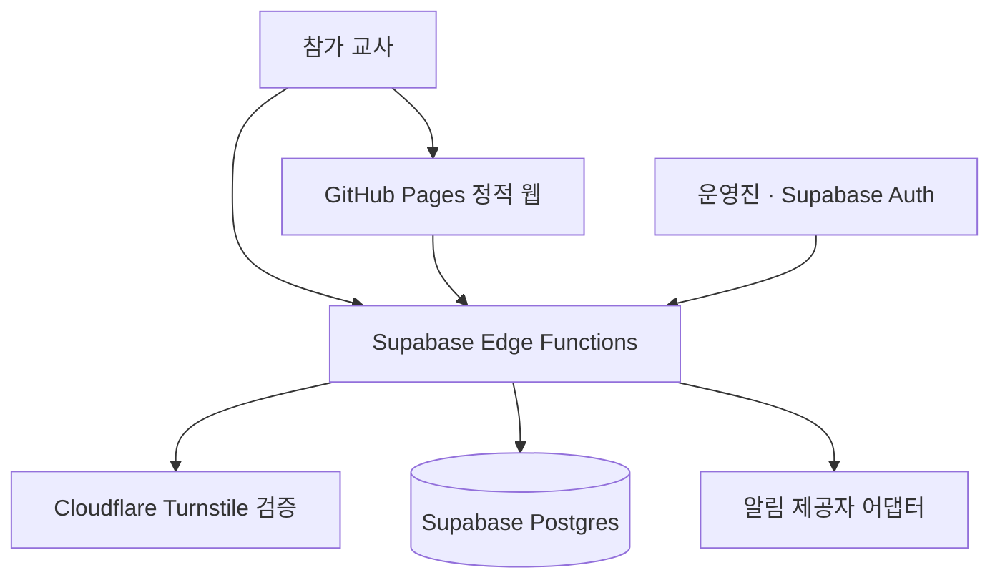
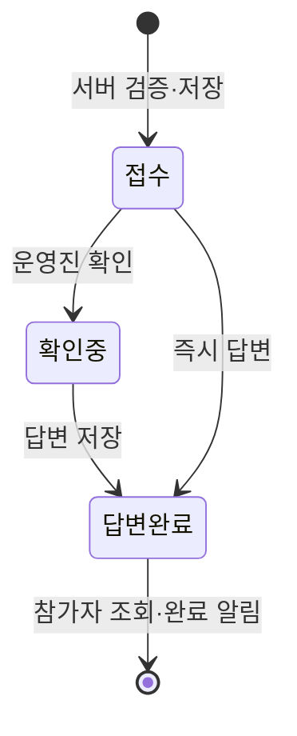

# 아키텍처

## 목표와 경계

행사 정보는 정적 파일로 빠르고 안정적으로 제공하고, 개인정보가 섞일 수 있는 질문·연락처·운영진 권한은 정적 호스트와 분리합니다. GitHub Actions는 검사·빌드·배포만 수행하며 공개 질문 API나 저장소 쓰기 통로로 사용하지 않습니다.

브라우저에는 정적 행사 정보와 Supabase publishable key만 둘 수 있습니다. 질문·연락처는 Edge Function에만 제출하며, 브라우저가 Data API 테이블에 직접 접근하지 않습니다. Edge Function은 Turnstile, 입력 스키마, 허용 출처, 속도 제한을 검증한 뒤 service-role 범위에서 최소 작업만 수행합니다.

## 프런트 구조

| 위치                    | 역할                                              |
| ----------------------- | ------------------------------------------------- |
| `src/config/events/`    | 행사 메타데이터와 활성 행사 선택                  |
| `src/content/events/`   | 일정, 서명, 협의실, 공지, FAQ, 준비물             |
| `src/components/`       | 정적 우선 UI와 필요한 최소 상호작용               |
| `src/pages/`            | 홈, 일정, 협의실, 이동, 질문, 상태, 운영진 라우트 |
| `src/styles/global.css` | 명찰 기반 디자인 토큰과 반응형 규칙               |
| `public/`               | 로고, PWA manifest, 서비스 워커                   |

Astro는 모든 핵심 안내를 HTML로 미리 렌더링합니다. 협의실 검색과 폼 검증만 브라우저 JavaScript를 사용합니다. React 런타임은 현재 필요하지 않아 포함하지 않았습니다.

행사 표시 텍스트는 `LocalizedText` 구조로 관리합니다. 초기 UI는 한국어만 렌더링하지만 영문 키를 추가하고 활성 locale 선택기를 연결할 수 있습니다.

## 질문 수명주기

1. 참가자는 유형·질문·선택 연락처·개인정보 금지 확인·Turnstile 토큰을 제출합니다.
2. `submit-question`이 크기/형식, 출처, 속도 제한, Turnstile의 action·hostname·single-use 토큰을 검증합니다.
3. 서버가 접수번호와 고엔트로피 비공개 토큰을 발급합니다. DB에는 토큰의 SHA-256 해시만 보관합니다.
4. 알림 제공자에는 접수번호·유형 등 최소 메타데이터만 전달하고 질문 원문과 연락처는 넣지 않습니다.
5. 참가자는 접수번호 또는 URL fragment의 비공개 토큰으로 `question-status`를 호출합니다.
6. 운영진은 Supabase Auth로 로그인하고 `event_operator_memberships` 권한 확인 후 목록·연락처·상태·답변을 다룹니다.

## 배포 구조

GitHub Pages 체크포인트는 `https://emotigom.github.io/nextbridge/` 하위 경로를 사용합니다. 최종 인쇄 QR은 Cloudflare가 관리하는 짧은 도메인 주소를 향하고, 그 주소가 현재 배포 위치로 리디렉션합니다. 호스팅을 바꾸더라도 인쇄물은 유지할 수 있습니다.

현재 Cloudflare Single Redirect는 고정 `302`이며 대상 상태 확인이나 자동 fallback을 수행하지 않습니다. `nextbridge-classroom-kit`의 기존 경로도 같은 GitHub Pages에 있으므로 독립적인 가용성 fallback으로 보지 않습니다.

외부 리소스 연결 전에는 질문 UI가 의도적으로 네트워크 전송을 중단합니다. 정적 안내 기능과 서버 기능을 독립적으로 출시·롤백할 수 있는 구조입니다.
